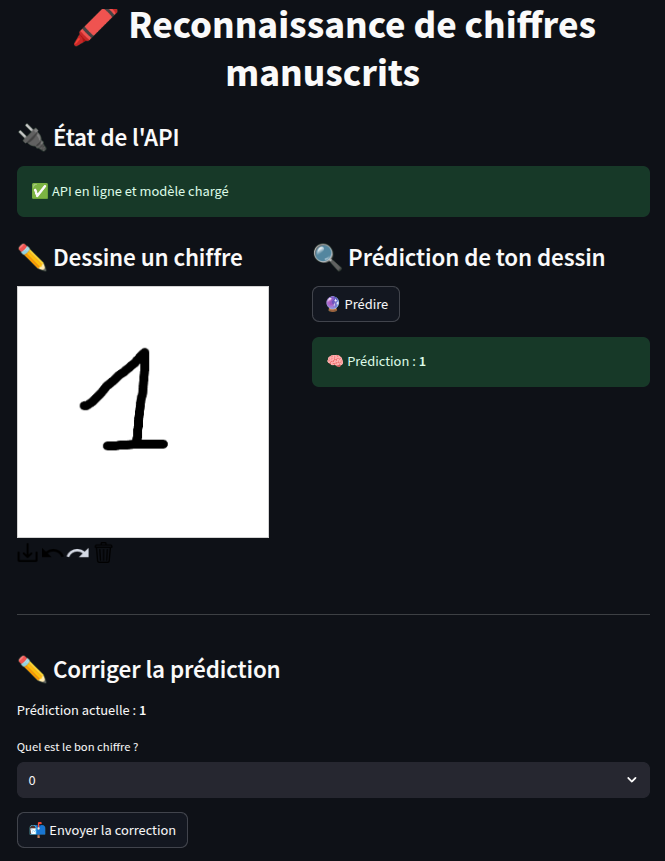

# 🧠 Digit Recognizer – FastAPI, Streamlit & Prefect

A full-stack machine learning project to recognize handwritten digits with a convolutional neural network (CNN).  
The project includes a FastAPI backend for predictions, a Streamlit frontend to visualize and test, and Prefect workflows to automate retraining when new data corrections are added.

---

## 📦 Project structure

```
├── app
│   ├── evaluate.py
│   ├── model.py
│   ├── train.py
│   └── train-optuna.py
├── data
│   ├── corrections.db
│   └── images/
├── docker-compose.yml
├── fastapi_app
│   ├── correct.py
│   ├── main.py
│   ├── predict.py
│   ├── requirements.txt
│   └── Dockerfile
├── grafana
│   └── provisioning
│       ├── dashboards
│       │   ├── dashboards.yml
│       │   └── system-dashboard.json
│       └── datasources
│           └── datasource.yml
├── logs
│   └── api.log
├── models
│   └── latest_model.h5
├── notebook.ipynb
├── prefect_flows
│   ├── training_flow.py
│   ├── requirements.txt
│   ├── Dockerfile
│   └── prefect.yaml
├── prometheus
│   └── prometheus.yml
├── README.md
├── requirements.txt
├── streamlit_app
│   ├── app.py
│   ├── requirements.txt
│   └── Dockerfile
└── uptime-kuma/
```

---

## 🌐 Virtual environment

**Linux**
```batch
python3 -m venv .venv
source .venv/bin/activate
```

**MacOS-Windows**
```batch
python -m venv .venv
.venv\Scripts\activate
```

---

## 🚀 How to run the project

> ⚠️ Make sure you have installed the required dependencies (`fastapi`, `uvicorn`, `streamlit`, `prefect`, `tensorflow`, etc.).

Example:

```bash
pip install fastapi uvicorn streamlit prefect tensorflow scikit-learn optuna pillow loguru
```

*(Adjust versions or use a `requirements.txt` if needed.)*

---

### ✅ Start the backend (FastAPI)

```bash
cd fastapi_app
uvicorn main:app --reload --host 0.0.0.0 --port 9500
```

API will be available at [http://localhost:9500](http://localhost:9500).

---

### 🎨 Start the frontend (Streamlit)

```bash
cd streamlit_app
streamlit run app.py
```

Web app will be available at [http://localhost:8501/](http://localhost:8501/).


---

### ⚙️ Start Prefect server

From the root directory:

```bash
prefect server start
```

Prefect interface will be available at [http://localhost:4500/](http://localhost:4500/).


---

### 🔁 Run the retraining flow manually

From the root directory:

```bash
python3 -m prefect_flows.training_flow
```

This checks the corrections database and triggers retraining if there are enough new corrections.

---

### 🐋 Run with docker

First, add a .env file in the root directory

```batch
GRAFANA_ADMIN_USER=YOUR_LOGIN
GRAFANA_ADMIN_PASSWORD=YOUR_PASSWORD
PROMETHEUS_PORT=9502
STREAMLIT_PORT=8501
FASTAPI_PORT=9500
API_URL=http://fastapi:8000
GRAFANA_PORT=9501
KUMA_PORT=9503
``` 

Compile docker with docker-compose

```batch
docker compose --env-file .env up --build
```

**Grafana** 
URL :  http://localhost:9501
Use credentials set in environment

**Kuma**
URL :  http://localhost:9503

## 🖼️ Preview



---

## 🧪 Search and development

Consult ```notebook.ipynb``` to watch model performance or best hyperparameters used 